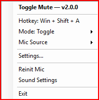
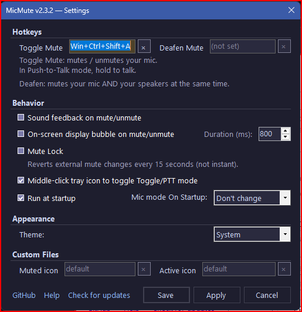

# MicMute

Global hotkey microphone mute/unmute for Windows.

A lightweight system tray utility that lets you mute and unmute your microphone from anywhere using a hotkey or tray icon click. Works at the Windows audio level — affects all apps at once (Zoom, Discord, Teams, etc.).

## Features

- **Global hotkey**: `Win + Shift + A` (configurable) toggles mic mute system-wide
- **Push-to-Talk mode**: Hold key to unmute, release to re-mute
- **Deafen mode**: Mute both mic and speakers simultaneously (separate hotkey)
- **Tray icon**: Green = active, Red = muted. Left-click to toggle.
- **On-screen display**: Floating dark bubble above the taskbar shows mute state
- **Mute Lock**: Prevents other apps from silently changing your mute state
- **Mic source selection**: Pick which microphone to control
- **Sound feedback**: Audible tone on mute/unmute (custom .wav support)
- **Custom icons**: Replace default tray icons with your own .ico files
- **Run at startup**: One-click toggle via Settings
- **Startup state control**: Start muted, unmuted, or remember last session
- **Explorer restart recovery**: Tray icon survives Explorer crashes
- **Auto-detect**: Automatically reconnects when you plug in a new mic

## Screenshots

| Active (Unmuted) | Muted | Tray Menu | Settings |
|:---:|:---:|:---:|:---:|
|  |  |  |  |

## Requirements

- Windows 10/11

## Installation

### Option 1: Download

Grab **[MicMute.exe](https://github.com/itsnateai/MicMute/releases/latest)** from the latest release — single file, self-contained, no .NET runtime needed.

### Option 2: Build from source

```bash
git clone https://github.com/itsnateai/MicMute.git
cd MicMute

# Framework-dependent (~280KB, requires .NET 8 runtime)
dotnet publish -c Release

# Self-contained (~150MB, no runtime needed)
dotnet publish -c Release --self-contained true
```

Output: `bin/Release/net8.0-windows/publish/MicMute.exe`

## Usage

### Modes

**Toggle** (default): Press the hotkey to mute, press again to unmute.

**Push-to-Talk**: Hold the hotkey to unmute. Release to re-mute. Switch via tray menu or middle-click the icon.

**Deafen**: Assign a separate hotkey in Settings. Mutes both mic and speakers. Press again to restore both.

### Tray Menu

Right-click the tray icon for the full menu:
- Toggle mute
- Change hotkey (supports AHK syntax: `#` Win, `^` Ctrl, `!` Alt, `+` Shift)
- Switch between Toggle and Push-to-Talk modes
- Select mic source
- Open Settings, Help, Sound Settings
- Reinitialise mic (if device changed)

## Customization

Settings are stored in `MicMute.ini` (auto-created next to the exe):

```ini
[General]
Hotkey=#+a
SoundFeedback=1
Mode=toggle
OSD_Enabled=0
OSD_Duration=1500
MuteLock=0
MiddleClickToggle=1
StartMuted=no
DeafenHotkey=
```

| Key | Default | Description |
|-----|---------|-------------|
| `Hotkey` | `#+a` | Main mute hotkey (AHK syntax) |
| `SoundFeedback` | `1` | Play tone on mute/unmute |
| `Mode` | `toggle` | `toggle` or `push-to-talk` |
| `OSD_Enabled` | `0` | Show on-screen mute indicator |
| `OSD_Duration` | `1500` | OSD display time in ms |
| `MuteLock` | `0` | Prevent external apps from changing mute |
| `MiddleClickToggle` | `1` | Middle-click tray to switch modes |
| `StartMuted` | `no` | `no`, `yes`, `unmuted`, or `last` |
| `DeafenHotkey` | *(empty)* | Hotkey for deafen mode |
| `DeviceId` | *(empty)* | Specific mic device (empty = system default) |
| `IconMuted` / `IconActive` | *(empty)* | Custom .ico file paths |
| `MuteSound` / `UnmuteSound` | *(empty)* | Custom .wav file paths |

## How It Works

MicMute uses the Windows Core Audio COM APIs (`IAudioEndpointVolume`) to control microphone mute state directly — no dependencies on any specific app. Global hotkeys are registered via `RegisterHotKey` and the tray icon is built using WinForms `NotifyIcon`.

A 5-second periodic sync timer detects external mute changes, device hot-plug events, and enforces Mute Lock when enabled.

## Project Structure

| Path | Description |
|------|-------------|
| `MicMute.csproj` | .NET 8 project file |
| `Program.cs` | Entry point — single-instance enforcement |
| `TrayApp.cs` | Main app — tray icon, hotkeys, mute logic, menus |
| `AudioManager.cs` | Core Audio COM interop — mute, enumerate, speaker control |
| `Config.cs` | INI config reader/writer with hotkey parsing |
| `OsdForm.cs` | On-screen display overlay (click-through, auto-dismiss) |
| `SettingsDialog.cs` | Settings GUI |
| `HotkeyDialog.cs` | Hotkey change dialog |
| `HelpWindow.cs` | Help text window |
| `NativeMethods.cs` | Win32 P/Invoke declarations |
| `ShortcutHelper.cs` | Windows .lnk shortcut creation for startup |
| `mic_on.ico` / `mic_off.ico` | Tray icons (embedded as resources) |
| `legacy/MicMute.ahk` | Original AutoHotkey v2 script (archived) |

## License

[MIT](LICENSE)
